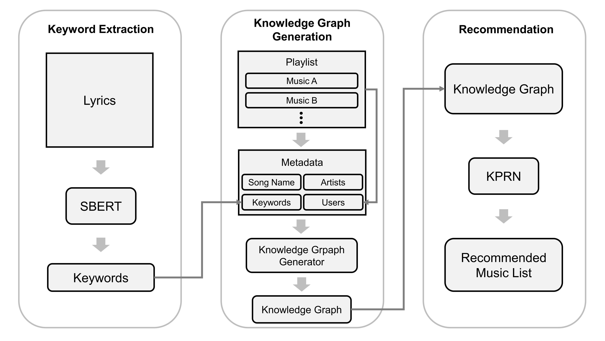

# Music-KPRN-with-Lyrics-Keyword
 

가사 키워드 추출을 활용한 지식 그래프 기반 음악 추천 시스템
 
 
 

&lt;Workflow of music recommender system using lyrics keyword extraction&gt;

 
 
 

- **Data** : train.json & song_meta.json
- **Crawling** : pre_crawling.py &#8594; daum_crawling.py &#8594; melon_crawling.py &#8594; concat the crawling files &#8594; after_crawling.py
- **KPRN-K** : keyword_extraction.py &#8594; data_preparation.py &#8594; make_paths.py &#8594; recommender.py
- **KPRN** : data_preparation.py &#8594; make_paths.py &#8594; recommender.py
 
 
 

### pre_crawling.py
    --interactions_file : [str] 플레이리스트 데이터 파일명
    
    ex) python pre_crawling.py --interactions_file train.json

- 크롤링할 노래 리스트 생성
- 크롤링할 노래 개수 확인
 

### daum_crawling.py
    --start_idx : [int] 크롤링할 노래 개수 지정 (첫번째 index) (default=-1 : 전체 노래 리스트)
    --end_idx : [int] 크롤링할 노래 개수 지정 (마지막 index) (default=-1 : 전체 노래 리스트)
    
    ex) python daum_crawling.py --start_idx -1 --end_idx -1

- Daum 검색을 통해 가사 크롤링
- 크롤링 대기시간(time.sleep)을 짧게 설정 가능하여 소요시간이 짧음
- Melon을 통한 크롤링은 Melon 노래 등록번호를 이용할 수 있으므로 정확하지만 소요시간이 너무 길다
- Daum을 통해 1차 크롤링
 

### melon_crawling.py
    --start_idx : [int] 크롤링할 노래 개수 지정 (첫번째 index) (default=-1 : 전체 노래 리스트)
    --end_idx : [int] 크롤링할 노래 개수 지정 (마지막 index) (default=-1 : 전체 노래 리스트)
    --filename_range : [str] Daum 크롤링 데이터 파일명 입력 (크롤링한 인덱스 범위 입력)
    
    ex) python melon_crawling.py --filename_range 0-615142 --start_idx -1 --end_idx -1

- Daum 크롤링에서 확실하게 크롤링되지 않은 가사를 Melon을 통해 크롤링
- 크롤링 대기시간(time.sleep)을 길게 설정해야하므로 소요시간이 길다
 

### after_crawling.py
    --daum_input : [str] Daum 크롤링 데이터 파일명
    --melon_input : [str] Melon 크롤링 데이터 파일명
    
    ex) python after_crawling.py --daum_input daum_0-615142.csv --melon_input melon_0-615142.csv

- 크롤링을 분할해서 한 경우, Daum / Melon 크롤링 파일들을 각각 병합하여 입력
- Daum / Melon 크롤링 데이터 병합 & 전처리
- 제외할 장르 설정
 

### keyword_extraction.py
    --file_input : [str] 크롤링 데이터 파일명
    --file_output : [str] 키워드 데이터 파일명
    
    ex) CUDA_VISIBLE_DEVICES=1 python keyword_extraction.py --file_input crawling.csv --file_output keyword.json

- 가사에서 키워드 추출
- 키워드 데이터 파일 생성
 

### data_preparation.py
    --songs_file : [str] 노래 데이터 파일명
    --interactions_file : [str] 플레이리스트 데이터 파일명
    --keywords_file : [str] 키워드 데이터 파일명
    --user_limit : [int] 사용할 플레이리스트 개수
    
    ex) python data_preparation.py --songs_file song_meta.json --interactions_file train.json --keywords_file keyword.json --user_limit 5000

- 데이터 전처리
 

### make_paths.py
    --train : [boolean] 학습 모드
    --eval : [boolean] 테스트 모드
    --kg_path_file : [str] path 데이터 파일명
    --samples : [int] 각 interaction마다 추출할 path 개수 (default=-1 : 전체 path 추출)
    
    ex) python make_paths.py --train --kg_path_file path_train_5000.pkl
        python make_paths.py --eval --kg_path_file path_test_5000.pkl

- path 데이터 생성
 

### recommender.py
    --train : [boolean] 학습 모드
    --eval : [boolean] 테스트 모드
    --model : [str] 저장할 모델명
    --kg_path_file : [str] path 데이터 파일명
    --rnn_type : [str] KPRN의 순환신경망 종류 지정 (rnn/lstm/gru) (default=lstm)
    --epochs[-e] : [int] epochs (default=5)
    --batch_size[-b] : [int] batch size (default=256)
    --lr : [float] learning rate (default=.002)
    --l2_reg : [float] L2 regularization coefficient (default=.0001)
    --gamma : [float] gamma (weighted pooling에 사용) (default=1)
    --load_checkpoint : [boolean] 체크포인트 로드
    --not_in_memory : [boolean] 메모리에 path 데이터 존재 여부
    --no_rel : [boolean] path에서 relation 제외하고 학습
    --np_baseline : [boolean] Run the model with the number of path baseline if True
    --samples : [int] 각 interaction마다 추출할 path 개수 (default=-1 : 전체 path 추출)

    ex) CUDA_VISIBLE_DEVICES=1 python recommender.py --train --model model_5000.pt --kg_path_file path_train_5000.pkl -e 10 -b 128
        CUDA_VISIBLE_DEVICES=1 python recommender.py --eval --model model_5000.pt --kg_path_file path_test_5000.pkl -b 128

- 음악 추천
 
 
 

## References
- 본 코드는 [KPRN 모델을 Python과 Pytorch로 구현한 terwilligers의 코드](https://github.com/terwilligers/knowledge-graph-recommender)를 기반으로 작성되었습니다.  
- KPRN 모델 논문 : [Explainable Reasoning over Knowledge Graphs for Recommendation](https://arxiv.org/abs/1811.04540)  
- 데이터 출처 : [Kakao Arena Melon Playlist Continuation](https://arena.kakao.com/c/8)  
